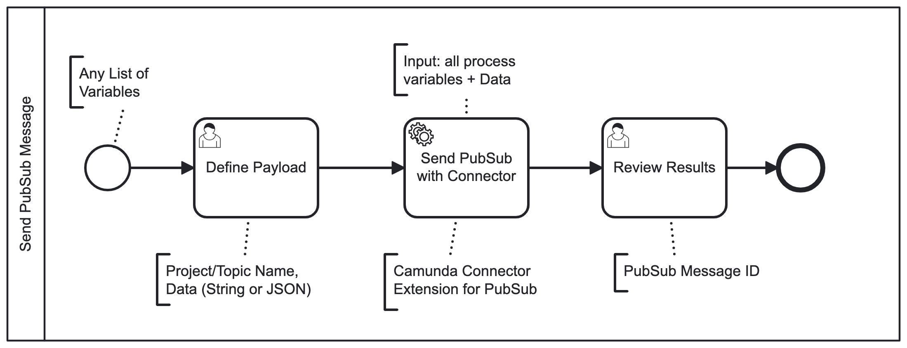

# Camunda BPM PubSub

A community extension for Camunda Platform 7 to integrate [Google PubSub](https://cloud.google.com/pubsub) in a process and interact with them.



## Features

* send pubsub message

## Install

> We support <mark>2 Versions</mark>:

* Version for <mark>Spring Boot 2</mark> (last Version 2.7.18, see [here](https://spring.io/blog/2023/11/23/spring-boot-2-7-18-available-now#end-of-open-source-support-for-spring-boot-2x)) and <mark>JDK8+</mark>
    * camunda-bpm-pubsub-spring-boot
    * camunda version 7.19.0 
* Version for <mark>Spring Boot 3</mark> (actual 3.5.6) and <mark>JDK17+</mark>
    * camunda-bpm-pubsub-spring-boot3
    * camunda version 7.24.0

### For Spring Boot

Read [these instructions](extension/spring-boot3/README.md).

### For Embedded Process Engine

Add `camunda-bpm-pubsub-core` as dependency to your application. Using Maven, you have to add the following lines to your POM:

```xml
<dependency>
  <groupId>camunda-bpm-examples</groupId>
  <artifactId>camunda-bpm-pubsub-core</artifactId>
  <version>1.0.0-SNAPSHOT</version>
</dependency>
```

## How to use it?

The extension is build on top of the [Connectors API](http://docs.camunda.org/manual/latest/reference/connect/) and provide some connectors for interacting with Google PubSub. The connectors can be used inside a process as implementation of a service task and are referenced by id. Use the Camunda Modeler to configure it.

```xml
<serviceTask id="Task_SendPubSubMessage" name="Send PubSub with Connector" camunda:asyncBefore="true">
  <extensionElements>
    <camunda:connector>
      <camunda:connectorId>pubsub-send</camunda:connectorId>
      <!-- input / output mapping -->
      <camunda:inputOutput>
        <camunda:inputParameter name="projectName">${projectName}</camunda:inputParameter>
        <camunda:inputParameter name="topicName">${topicName}</camunda:inputParameter>
        <camunda:inputParameter name="attributes">${execution.getVariables()}</camunda:inputParameter>
        <camunda:inputParameter name="data">${data}</camunda:inputParameter>
        <camunda:outputParameter name="messageId">${messageId}</camunda:outputParameter>
      </camunda:inputOutput>
    </camunda:connector>
  </extensionElements>
  ...
</serviceTask>
```

See the [connectors user guide](http://docs.camunda.org/manual/latest/user-guide/process-engine/connectors/) how to configure the process engine to use connectors.

### Send PubSub

Connector-Id: pubsub-send

| Input parameter | Type                                   | Required?             |
|-----------------|----------------------------------------|-----------------------|
| projectName     | String                                 | no (read from config) |
| topicName       | String                                 | no (read from config) |
| attributes      | Map<String, Object>                    | no                    |
| data            | String                                 | no                    |

| Output parameter | Type   |
|------------------|--------|
| messageId        | String |

## How to configure it?

By default, the extension loads the configuration from a properties file `pubsub-config.properties` on classpath. You can change the lookup path using the environment variable `PUBSUB_CONFIG`. If you want to look up a file on the classpath, use the `classpath:` prefix (e.g. `classpath:/my-application.config`).

An example configuration can look like:

```properties
# Activate one of GOOGLE_APPLICATION_CREDENTIALS or PUBSUB_EMULATOR_HOST

# Google PubSub
# GOOGLE_APPLICATION_CREDENTIALS=classpath:your-pubsub-credentials.json

# PubSub Emulator
# PUBSUB_EMULATOR_HOST=0.0.0.0:8085

# PubSub Common
PUBSUB_PROJECT_NAME=your-project-id
PUBSUB_TOPIC_NAME=your-topic-id
```

## Examples

The following examples shows how to use the connectors and services.

* [Send Message](examples/send-message3/README.md)
    * start process with a list of variables
    * user task to optionally change `project/topicName` and set the `data` field (String or JSON)
    * send message to pubsub `projectName/topicName` using `pubsub-send` connector
        * attributes = ${execution.getVariables()}
        * data = ${data}
    * user task to review the results, specifically PubSub `messageId`

### OWASP dependency check:
```
mvn dependency-check:aggregate -Pdependency-check
```

## License

[Apache License, Version 2.0](./LICENSE)
